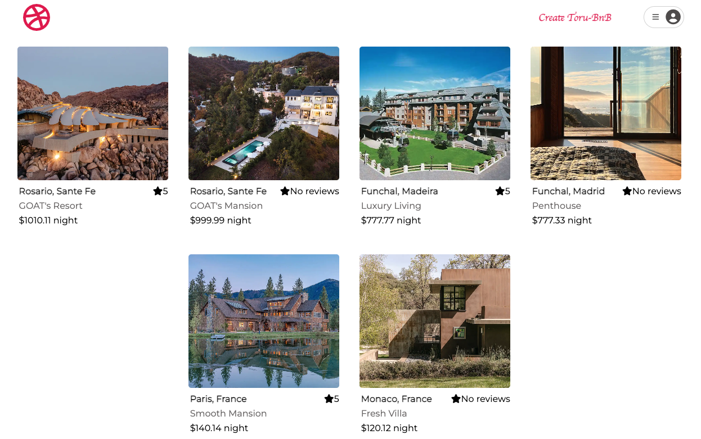
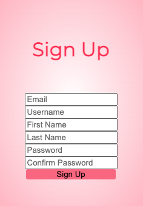
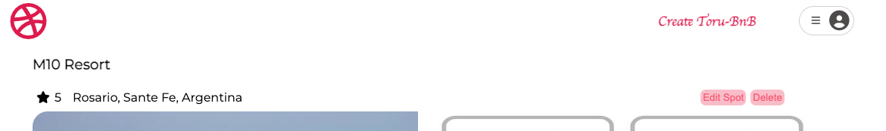
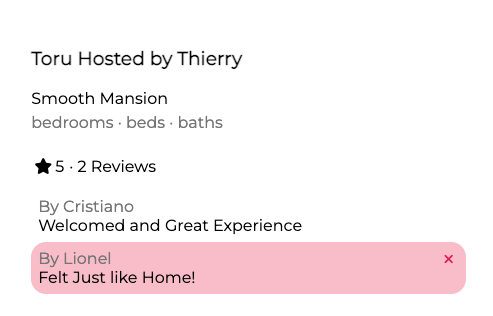

# Welcome to Toru-BnB

[Toru-BnB](https://toru-bnb.onrender.com) is an AirBnb Clone web application that was built by an AppAcademy Student in attempt to learn and build a solid foundation to becoming a Full-Stack developer. [Toru-BnB](https://toru-bnb.onrender.com) is an application where users can list their property for those looking for an amazing experience. New-users can conveniently sign-up and list their properties on [Toru-BnB](https://toru-bnb.onrender.com).

* This project is built utilizing:
    * React
    * Redux
    * CSS
    * FontAwesome for icons
    * Google Fonts for fonts

If you [click-here](https://toru-bnb.onrender.com) this should take you to Toru-BnB home page.

Sign-Up if you haven't already by clicking the profile button on the top right, and click on the sign up. You should see a modal for sign up.

Once you have signed-up and logged in, you can list your property by clicking on Create Toru-Bnb, which can be edited and deleted anytime you wish by clicking on the button located on the top right of the property page you listed.

You can also write reviews on the houses you've previously stayed and delete your comments if you wish (hit the 'x' button on the comment box to delete your comment). Note you are only allowed to leave one comment on a property at the moment.

